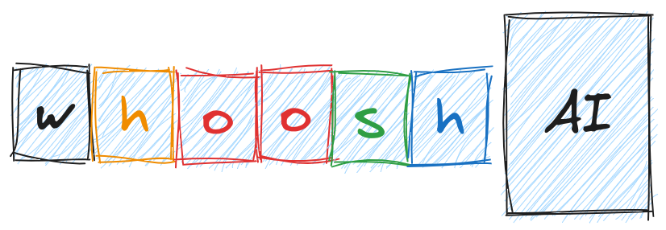

В условиях города, учитывая пробки, ремонтные работы, невозможность перейти дорогу и, принимая во внимание, что есть места, где пройдет пешеход и никак не проедет водитель самоката, граф $G=(V,E)$ не является постоянным, а зависит сам по себе от времени, погоды, и состояния города. $G=G(t)=(V, E=E(t))$. 

Формально, это означает, что веса ребер между любыми двумя опорными точками (октогранниками) пересчитываются постоянно каждые $\hat{T}$ минут и, скажем, правильный путь, который был правильным между МГУ и кластером Ломоносов утром, не будет таковым вечером.

Все факторы (признаки),  влияющих на маршрут, можно условно разделить на три группы: Те, которые можно зафиксировать, используя информацию со стороны официальных (вызов по api к сторонним ресурсам), те, что можно получить исходя из данных сенсоров с самого самоката (качество дорожного покрытия), и те, которые можно обнаружить только по историческим маршрутам пользователей на основании статистики. 

Строго говоря, количество признаков не является ограничивающим фактором модели, а, наоборот, позволяет ей учитывать и строить более “умные” пути. Например, аварии или перекрытия никак не отследить без постоянного мониторинга маршрутов пользователей.

